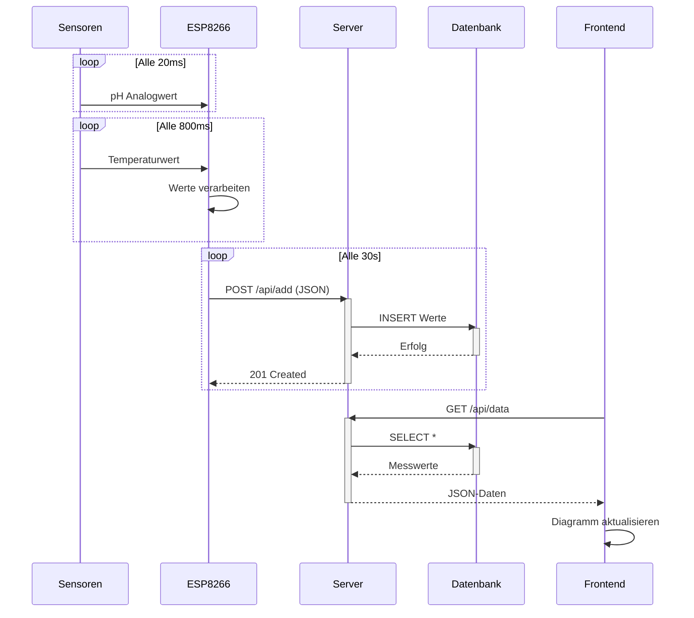

# Küstenkind Monitoring System
## Einführung
In diesem Projekt werden mithilfe eines ESP8266 Wasserparameter (pH-Wert und Temperatur) überwacht. Die Sensordaten werden an einen lokalen Node.js bzw. TypeScript-Server übertragen und in einer SQLite-Datenbank gespeichert. Eine Webanwendung zeigt die Daten in Echtzeit an.
## Systemarchitektur


## Hardware-Anforderungen
- ESP8266 (z.B. NodeMCU)
- DS18B20 Temperatursensor
- pH-Sensor mit Analogausgang
- Stromversorgung (USB oder externe Quelle)

## Software-Anforderungen
- Arduino IDE (mit ESP8266 Board Support)
- Node.js (v18 oder höher)
- SQLite3
- Git (optional)

# Einrichtung
1. Serverinstallation ins Terminal:
```bash
cd server
npm install
```
2. Dann bearbeite `.env` im `ts_project`- Ordner
```env
PORT=3000
DB_PATH=./sensor.db
API_KEY=dein_geheimer_schluessel
```
<small> Info: Dieser Schritt ist optional, by default ist der Port: 3000 und der API-Key: meow. Bearbeite diese, falls du andere benutzen möchtest! :P </small>

3. Um den Server zu starten, den **Ordner** von ```ts_project```öffnen. Wichtig, den **Ordner**, nicht die Datei von ```server.ts```!! Dann folgendes ins Terminal eingeben: 
```bash
npx nodemon src/server.ts
```
Jetzt sollte dein Server erreichbar sein und die IP-Adresse + Port herausgegeben werden :3 (yippiiee!) 

## ESP8266 Konfiguration
1. Öffne `kuestenkind.ino` in der Arduino IDE
2. Passe folgendes an:
```cpp
const char* ssid = "DEIN_WLAN_SSID";
const char* password = "DEIN_WLAN_PASSWORT";
const char* server = "WAS_AUCH_IMMER_IP"; // lokale ip des servers
const int port = 3000;
const char* apiKey = "meow"; // muss mit .env übereinstimmen
```
Info: Wenn du, warum auch immer, kein Interesse hast die Ausgabe des Terminals zu lesen. Könntest du auch in cmd `ipconfig` schreiben und somit deine IPv4-Adresse herauszufinden. 

3. Jetzt musst du die erforderlichen Bibliotheken installieren, falls diese nicht vorhanden sind:
- ESP8266WiFi (normalerweise in Arduino vorinstalliert)
- ESP8266HTTPClient (normalerweise in Arduino vorinstalliert)
- OneWire
- DallasTemperature
4. Jetzt ins ESP8266 hochladen

## Kalibrierung
Es ist sehr wahrscheinlich, dass du deinen ph-Sensor noch kalibrieren musst. Schau dafür in die Dokumentation deines Sensors :P 

## Verwendung
1. ESP8266 mit Strom versorgen
2. Seriellen Monitor öffnen (115200 Baud) zur Kontrolle:
```text
Verbinde mit WiFi.....
WiFi verbunden!
IP-Adresse: idk
Server-URL: was auch immer
Temperature: 25.50 °C    Voltage: 2.06 V    pH: 9.01
Daten erfolgreich an Server gesendet!
```
Webanwendung öffnen:
deine ip + port (siehe terminal-ausgabe) oder http://localhost:3000

## API-Endpunkte
- Daten senden (ESP8266):
`POST /api/add`
```json

{"temperature":25.50, "ph":9.01}
```

Daten abfragen (Frontend):
`GET /api/data`
```json

[
  {
    "id": 1,
    "temperature": 25.5,
    "ph": 9.01,
    "timestamp": "2025-07-18T18:34:56.789Z"
  }
]
```
# Fehlerbehebung
## Häufige Probleme
1. Keine WiFi-Verbindung:
- SSID/Passwort prüfen
- Signalstärke überprüfen (RSSI in Ausgabe)
- ESP8266 Neustart
2. Server nicht erreichbar:
- IP-Adresse des Servers bestätigen
- Firewall-Einstellungen prüfen (Port 3000)
- Server laufen lassen mit npx nodemon src/server.ts
3. Ungültige Sensordaten:
- Sensorverbindungen prüfen
- Kalibrierung durchführen
- Spannungsversorgung sicherstellen
4. API-Key Fehler:
- Gleichen Schlüssel in .env und ESP-Code verwenden
- Server nach Änderungen neustarten

Falls es noch zu weiteren Fehlern kommen sollte, habt keine Scheu uns zu kontaktieren! 
# Und danke fürs lesen! C:
